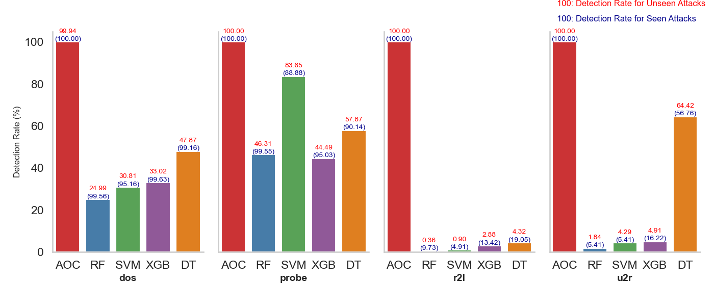

# AOC-IDS😁

本项目基于  
https://github.com/xinchen930/AOC-IDS/

原始论文  
[AOC-IDS: Autonomous Online Framework with Contrastive Learning for Intrusion Detection" (Infocom 2024)
Xinchen Zhang, Running Zhao, Zhihan Jiang, Zhicong Sun, Yulong Ding, Edith C.H. Ngai, Shuang-hua Yang.](https://ieeexplore.ieee.org/document/10621346/)

我在作者公开的代码基础上，补充了其他缺失的一部分实验，包括数据预处理等环节。

# 实验环境 💕

```
lsb_release -a

# No LSB modules are available.
# Distributor ID: Ubuntu
# Description:    Ubuntu 22.04.1 LTS
# Release:        22.04
# Codename:       jammy

python --version
# python3.12.0
import torch print(__torch.version__)
# 2.5.1+cu124
```

# 文件说明 😘

## 数据集 🤡

### 原始数据集 🤡

KDD 数据集：NSL_KDD_Test.csv, NSL_KDD_Train.csv

NB15 数据集：UNSW_NB15_testing-set.csv, UNSW_NB15_training-set.csv

### 预处理后的数据集 🤡

KDD 数据集：en_KDDTrain+.csv, en_KDDTest+.csv

NB15 数据集：太大，没传上来（可以通过运行代码 preprocess.ipynb 获取）

**建议：使用原始代码仓库中提供的数据集，此处只是模拟了预处理的过程，无法保证结果与作者提供的预处理数据集完全一致。**

## 代码说明 🤡

1.preprocess.ipynb：预处理原始数据集，生成预处理后的数据集

2.nsl-kdd.ipynb：使用 NSL-KDD 数据集 训练，在线学习

3.unsw_nb15.ipynb：使用 NB15 数据集 训练，在线学习

4.消融实验\_infonce.ipynb: 消融实验，使用 InfoNCE Loss 替换 CRC loss

5.消融实验\_只使用编码器.ipynb: 消融实验，只使用编码器的预测结果

6.消融实验\_只使用解码器.ipynb: 消融实验，只使用解码器的预测结果

7.inital.ipynb 初始训练

8.offline.ipynb 离线训练

9.ml_unsw.py 一些机器学习的对比模型

10.ml_kdd.py 同 9

11.ml_zero_attack.py 用机器学习方法评估零日攻击检测

<<<<<<< HEAD
12.plot_zero_attack.py 画图，选用召回率作为数据
=======
12.plot_zero_attack.py 画图，选用召回率作为指标
>>>>>>> 59e8f229e458991d7653c850f8084cf0a2334b91

## 实验结果 🤦‍♀️

### 综合对比 🤦‍♂️

<<<<<<< HEAD
=======
<table style="margin: 0 auto; text-align: center;">
  <tr>
    <td rowspan="2"></td>  
    <th colspan="4">UNSW - NB15</th>
    <th colspan="4">NSL - KDD</th>
  </tr>
  <tr>
    <th>Precison</th>
    <th>Recall</th>
    <th>Accuracy</th>
    <th>F1</th>
    <th>Precison</th>
    <th>Recall</th>
    <th>Accuracy</th>
    <th>F1</th>
  </tr>
  <tr>
    <th>AOC-IDS</th>
    <td>92.56</td>
    <td>88.83</td>
    <td>89.92</td>
    <td>90.66</td>
    <td>78.11</td>
    <td>99.99</td>
    <td>84.04</td>
    <td>87.71</td>
  </tr>
  <tr>
    <th>RF</th>
    <td>77.46</td>
    <td>99.34</td>
    <td>83.72</td>
    <td>87.04</td>
    <td>96.74</td>
    <td>62.98</td>
    <td>77.71</td>
    <td>76.29</td>
  </tr>
  <tr>
    <th>DTC</th>
    <td>80.52</td>
    <td>95.21</td>
    <td>84.68</td>
    <td>87.25</td>
    <td>91.02</td>
    <td>68.66</td>
    <td>78.30</td>
    <td>78.28</td>
  </tr>
  <tr>
    <th>SVM</th>
    <td>75.11</td>
    <td>99.59</td>
    <td>81.60</td>
    <td>85.63</td>
    <td>92.01</td>
    <td>63.87</td>
    <td>76.28</td>
    <td>75.40</td>
  </tr>
  <tr>
    <th>XGBoost</th>
    <td>77.57</td>
    <td>98.72</td>
    <td>83.58</td>
    <td>86.87</td>
    <td>91.81</td>
    <td>64.27</td>
    <td>76.40</td>
    <td>75.61</td>
  </tr>
</table>
</table>

### 消融实验 🤷‍♀️
>>>>>>> 59e8f229e458991d7653c850f8084cf0a2334b91
<table style="margin: 0 auto; text-align: center;">
  <tr>
    <td rowspan="2"></td>  
    <th colspan="4">UNSW - NB15</th>
    <th colspan="4">NSL - KDD</th>
  </tr>
  <tr>
    <th>Precison</th>
    <th>Recall</th>
    <th>Accuracy</th>
    <th>F1</th>
    <th>Precison</th>
    <th>Recall</th>
    <th>Accuracy</th>
    <th>F1</th>
  </tr>
  <tr>
    <th>AOC-IDS</th>
    <td>95.28</td>
    <td>85.82</td>
    <td>89.85</td>
    <td>90.30</td>
    <td>82.59</td>
    <td>97.74</td>
    <td>86.98</td>
    <td>89.53</td>
  </tr>
  <tr>
    <th>RF</th>
    <td>77.46</td>
    <td>99.34</td>
    <td>83.72</td>
    <td>87.04</td>
    <td>96.74</td>
    <td>62.98</td>
    <td>77.71</td>
    <td>76.29</td>
  </tr>
  <tr>
    <th>DTC</th>
    <td>80.52</td>
    <td>95.21</td>
    <td>84.68</td>
    <td>87.25</td>
    <td>91.02</td>
    <td>68.66</td>
    <td>78.30</td>
    <td>78.28</td>
  </tr>
  <tr>
    <th>SVM</th>
    <td>75.11</td>
    <td>99.59</td>
    <td>81.60</td>
    <td>85.63</td>
    <td>92.01</td>
    <td>63.87</td>
    <td>76.28</td>
    <td>75.40</td>
  </tr>
  <tr>
    <th>XGBoost</th>
    <td>77.57</td>
    <td>98.72</td>
    <td>83.58</td>
    <td>86.87</td>
    <td>91.81</td>
    <td>64.27</td>
    <td>76.40</td>
    <td>75.61</td>
  </tr>
</table>

### 消融实验 🤷‍♀️

<table style="margin: 0 auto; text-align: center;">
  <tr>
    <td rowspan="2"></td>  
    <th colspan="4">UNSW - NB15</th>
    <th colspan="4">NSL - KDD</th>
  </tr>
  <tr>
    <th>Precison</th>
    <th>Recall</th>
    <th>Accuracy</th>
    <th>F1</th>
    <th>Precison</th>
    <th>Recall</th>
    <th>Accuracy</th>
    <th>F1</th>
  </tr>
  <tr>
    <th>AOC-IDS</th>
    <td>95.28</td>
    <td>85.82</td>
    <td>89.85</td>
    <td>90.30</td>
    <td>82.59</td>
    <td>97.74</td>
    <td>86.98</td>
    <td>89.53</td>
  </tr>
  <tr>
    <th>InfoNCE</th>
    <td>96.44</td>
    <td>79.46</td>
    <td>87.08</td>
    <td>87.13</td>
    <td>85.19</td>
    <td>96.08</td>
    <td>88.26</td>
    <td>90.31</td>
  </tr>
  <tr>
    <th>w/o encoder</th>
    <td>92.38</td>
    <td>88.40</td>
    <td>89.60</td>
    <td>90.35</td>
    <td>79.67</td>
    <td>97.97</td>
    <td>84.62</td>
    <td>87.88</td
  </tr>
  <tr>
    <th>w/o decoder</th>
    <td>94.29</td>
    <td>86.13</td>
    <td>89.49</td>
    <td>90.03</td>
    <td>81.19</td>
    <td>97.75</td>
    <td>85.83</td>
    <td>88.71</td>
  </tr>
</table>

### online&offline&inital 🤷‍♂️

<table style="margin: 0 auto; text-align: center;">
  <tr>
    <td rowspan="2"></td>  
    <th colspan="4">UNSW - NB15</th>
    <th colspan="4">NSL - KDD</th>
  </tr>
  <tr>
    <th>Precison</th>
    <th>Recall</th>
    <th>Accuracy</th>
    <th>F1</th>
    <th>Precison</th>
    <th>Recall</th>
    <th>Accuracy</th>
    <th>F1</th>
  </tr>
  <tr>
    <th>online</th>
    <td>95.28</td>
    <td>85.82</td>
    <td>89.85</td>
    <td>90.30</td>
    <td>82.59</td>
    <td>97.74</td>
    <td>86.98</td>
    <td>89.53</td>
  </tr>
  <tr>
    <th>offline</th>
    <td>99.36</td>
    <td>73.87</td>
    <td>85.35</td>
    <td>84.74</td>
    <td>88.09</td>
    <td>90.19</td>
    <td>87.48</td>
    <td>89.13</td>
  </tr>
  <tr>
    <th>inital</th>
    <td>90.21</td>
    <td>87.79</td>
    <td>88.03</td>
    <td>88.98</td>
    <td>77.82</td>
    <td>97.67</td>
    <td>82.82</td>
    <td>86.62</td>
  </tr>

</table>

### 零日攻击检测 💑



# Notice❗

1. 由于我无法保证与作者相同的实验环境，所以很多实验结果无法与论文中的结果保持一致。
2. 代码可能有许多有错误和疏忽的地方，还请多多指教。
3. 原作者提供的代码，有指定 5 次训练轮次，我这里没有指定，默认只训练一次。
<<<<<<< HEAD
4. 根据我的测试，即使是完全相同的代码，放在 windows 和 linux 上运行（没有控制两台机器使用相同的 torch 和 python 版本），会得到完全不同的结果，一个的所有评估得分均为 1，另一个只能有 0.8x 的得分。
=======
5. 根据我的测试，即使是完全相同的代码，放在 windows 和 linux 上运行（没有控制两台机器使用相同的 torch 和 python 版本），会得到完全不同的结果，一个的所有评估得分均为 1，另一个只能有 0.8x 的得分。
>>>>>>> 59e8f229e458991d7653c850f8084cf0a2334b91

# 感谢和参考 ❤️❤️❤️

感谢论文作者公开源代码，方便其他人在此基础上进行研究。

其他参考的代码：

https://github.com/Mamcose/NSL-KDD-Network-Intrusion-Detection/tree/master  
https://github.com/thinline72/nsl-kdd


